## Wine prediktálása

A feladat alapjául egy 2022-es adatállományt választottunk, amely a borok adott tulajdonságait és azon értéleléseit tartalmazza. Az alábbi tulajdonságokkal rendelkezik:

| fixed acidity | volatile acidity | citric acid | residual sugar | chlorides | free sulfur dioxide | total sulfur dioxide | density | pH | sulphates | alcohol |
|---------------|------------------|-------------|----------------|-----------|---------------------|----------------------|---------|----|-----------|---------|
|               |                  |             |                |           |                     |                      |         |    |           |         |

A célunk a minőség prediktálása volt:

| quality |
|---------|
|         |

A feladatban azt terveztük, hogy megpredikáljuk az egyes borok minőségét az alábbi tulajdonságok alapján a lehető legpontosabban. Ehhez felügyelt tanítást használtuk és többféle operátorral is elvégeztük a predikálásokat, hogy megnézzük melyikkel van a legkevesebb hiba lehetőség. Az alábbi operátorokkal predikáltunk:
 - Neurális háló
 - Mély tanulás
 - Döntési fa

Mindegyikket kettőször hajtottuk végig két különböző beállítással, hogy megvizsgáljuk és felmérjük mely beállítás segíthet a legpontosabb eredményekhez.

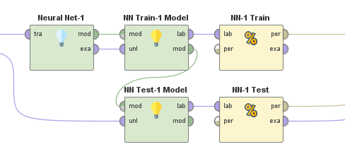

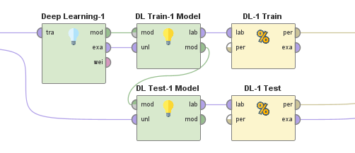

(Képek a belső sub-processekről)

#### Neurális háló 

Az első párosunk az a két neurális háló volt ahol a következők beállításokkal végeztünk prediktálásokat:

Az első:
 - Hidden layerek száma: H1 - 2 és H2 - 2
 - Training cycles: 64
 - Learning rate: 0.01
 - Momentum: 0.9
 - Shuffle
 - Error epsilon: 1.0E-4

 Az második:
 - Hidden layerek száma: H1 - 16, H2 - 8 és H3 - 4
 - Training cycles: 64
 - Learning rate: 0.01
 - Momentum: 0.9
 - Shuffle
 - Error epsilon: 1.0E-4

 Az első neutrális hálónál csak két hidden layert használtunk és a relative errorunk (pontosságot nem tudtunk nézni az adatállományon így relativ error-t figyeltük) a test esetén 9.30% míg a train esetén 8.54% volt. A hidden layer méretének növelésével (H1 - 4/8/16/32 és H2 - 4/8/16/32) kissebb romlást véltünk felfedezni a relativ errorban, a 2-es méret tűnt a legmegfelelőbbnek e szempontjából. 
 
 Ezután a training cycleket állítottuk ahol 200 (Test: 9.24 - Train: 8.44), 300 (Test: 9.01 - Train 8.34), 400 (Test: 8.40 - Train: 8.27), 1000 (Test: 8.93 - Train: 8.18), és 2000 (Test: 8.98 - Train: 8.18) eredményeit vizsgáltuk meg. A növelése kis mértékben javíthat a hibán de ennek a végtelenbe való emelése egy idő után már nem igazán változtat a végeredményen. 

 A learning cycle növelése szintén a relative error romlásához vezetett, 0.02 (Test: 9.55 - Train: 8.60), 0.03 (Test: 10.27 - Train: 9.33), 0.05 (Test: 11.15 - Train: 10.12), és 0.1 esetén (Test: 11.79 - Train: 10.71).

 A második neurális hálónál már három hidden layerrel dolgoztunk ahol a relative error a test esetén 11.78% volt míg a trainnél pedig 10.98%. A többi beállítást ugyanúgy állítottuk, hogy megnézzük mennyivel másabb ha három darab layer van. Az előbb felsorolt változtatásokat ezen is végrehajtottuk. (Eredmények: 11.92 11.06, 11.05 9.93, 11.16 10.28, 11.35 10.87, 10.57 9.23). A learning cycle emelése ugyanúgy romláshoz vezetett.

 #### Mély tanulás

 A mély tanulásnál három fajtánk volt: TanhWithDropout (2x 50, 0.125 ratio), RectifierWithDropout két layerrel (2x 50, 0.125 ratio) és RectifierWithDropout három layerrel (3x 100, 0.125 ratioval). 

 Az alap beállításoknál az első 10.48% (test) és 9.10% (train)-t produkált. Ennek minimális növelése javított az eredményen (2x 125-nél 9.72% és 7.75%-ot hozott) viszont a túlságos növelése megint romláshoz vezetett a relative error-ban. Az epoch növelésével nagy mértékben is lehetett javítani viszont annal túlságosan nagy növelése később már csak minimálisan eredményezett jobb relative errort (századokban javult csak).

 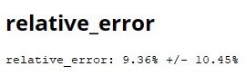
 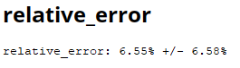

 A második Rectifier alap beállításokkal egy egész százalékkal jobb eredményt hozott az elsőhöz képest (Test: 10.48% - Train: 9.10%). Ezen végrehajtva az előzőeket a layer növelés a teszten nem de a train verzión javított (túlságosan megnöveljük akkor ugyanúgy romlik). Epoch növelése szintén javított ezen a prediktáláson is.

 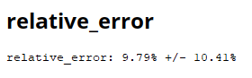
 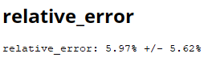

 A harmadik hasonló volt a másodikhoz azzal a kivétellel, hogy ott megvizsgáltuk milyen ha 3 layer van és 100-as értéken (raito továbbra is 0.125). Az alap beállításos eredmények azok test 9.78% és train 7.98% viszont az epoch növelésével ez eredményezte a legjobbat. A train részén 4.77%-ra javult valamint a "+-" rész a korábbi 10% -ról  4.69%-re csökkent. Így kimondhatjuk, hogy a legjobb eredményt a harmadik mély tanulás hozta ezen beallításokkal.

 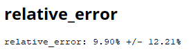
 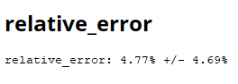

 Az alábbi képen látható az eredmény fül:

 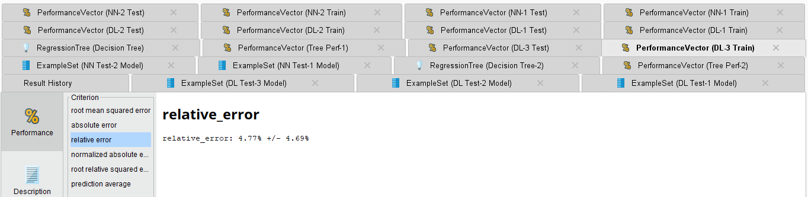

 és maga a program design-ja:
 
 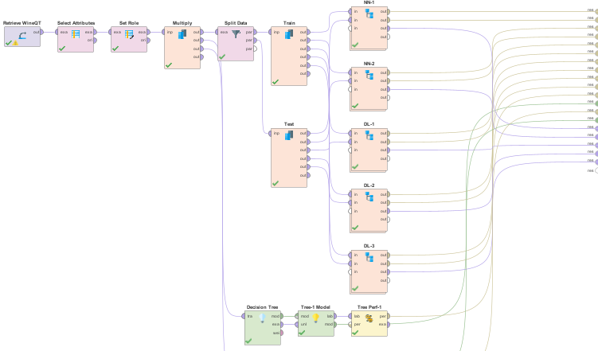

 (egy decision tree már nem fért bele)

#### Döntési fák

Ezen felül még készítettünk két döntési fát a modellekről az "accuracy" hiányában ami így néz ki:

 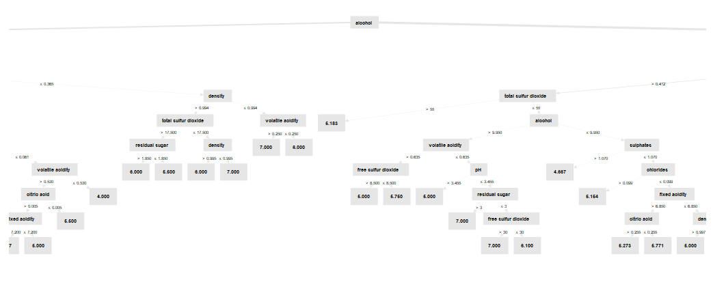

 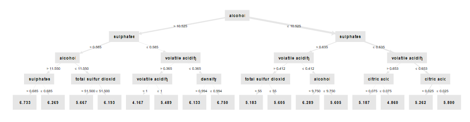

 Az első képen a teljes fa látható viszont ez átláthatatlanná tette és nem is fért bele egy képbe de a másodikon már egy minimálisan változtattunk. Ezen a fán már jó látható, hogy azon borok minősége ahol magassabb az alkohol tartalom ott jóval magasabbra perdiktálta a minőség értékét is.

 ## Pytorch modellezés és eredményei

 16 epochon keresztül nem javult a teszt loss akkor az utolsó legjobbat állítottuk vissza mert akkor nem javult tovább (túl tanult).

 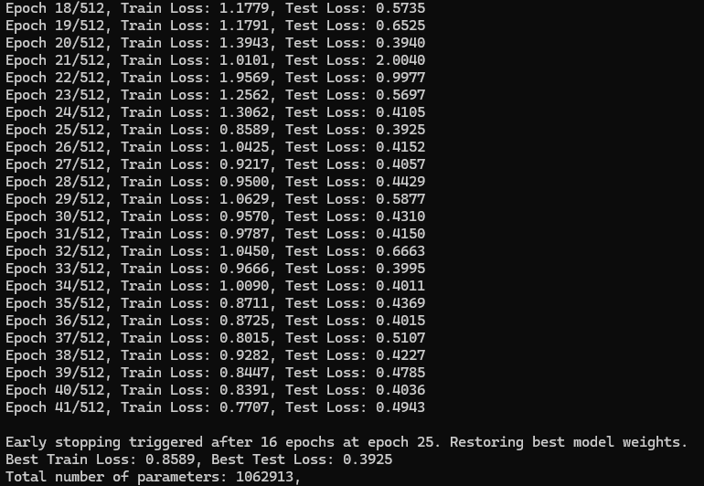

 ### Modell építés

 A jó modell (Lrelu), optimalizálás után megpróbáltunk megfelelő számú paramétert kinyerni utána ebből további featureket kinyerni. Ez lett a legjobb eredmény, test loss: 0.3572
 
 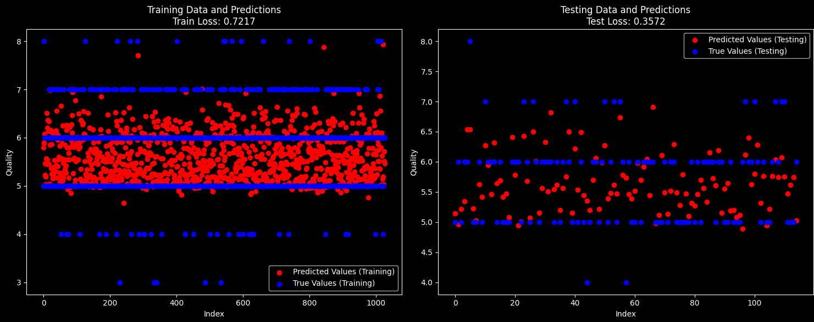

 TANH rejtett réteg

 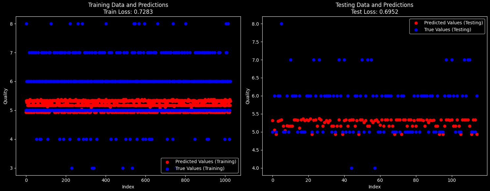

Sigmoid rejtett rétegbeli aktivációs függvény

 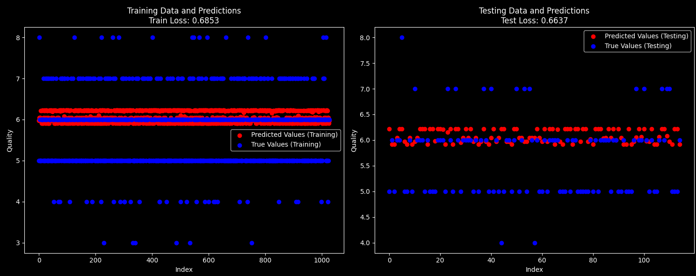

 ### Szimulált hűtés

 Szimulált hűtést alkalmaztunk ahol a bemeneti függvény helyett a modellt használtuk, hogy megprediktáljuk azokat a tulajdonságokat, egy olyan bort ami nincsen benne a CSV-be elkerülve a lokális minimumokat.

 Minél magasabb volt az alkohol tartalom annál jobbra predikálta a bor minőségét.
 
 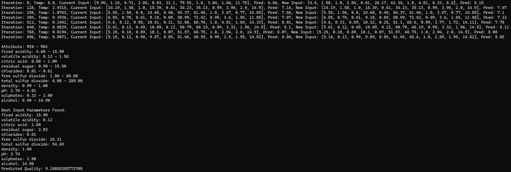